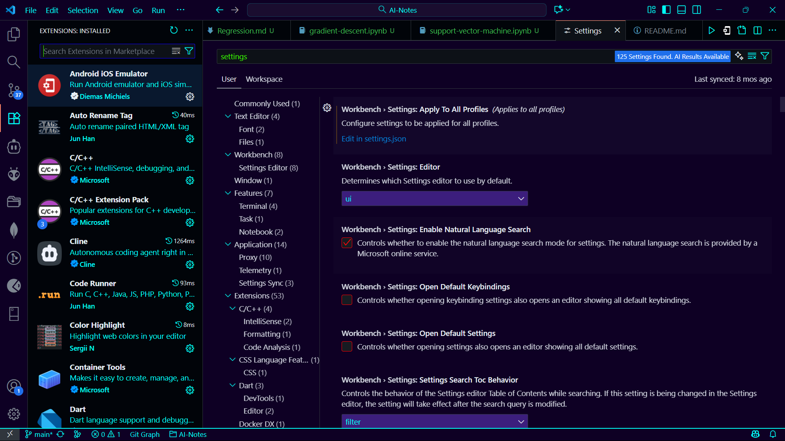

# Black Neon

A sleek dark theme with glowing accents. When Visual Studio Code is focused, the interface glows **cyan**; when unfocused, it shifts to **neon green**.

## Activation

After installation:
1. Open Command Palette (Ctrl+Shift+P)
2. Choose “Preferences: Color Theme”
3. Select “Black Neon”

## Preview

